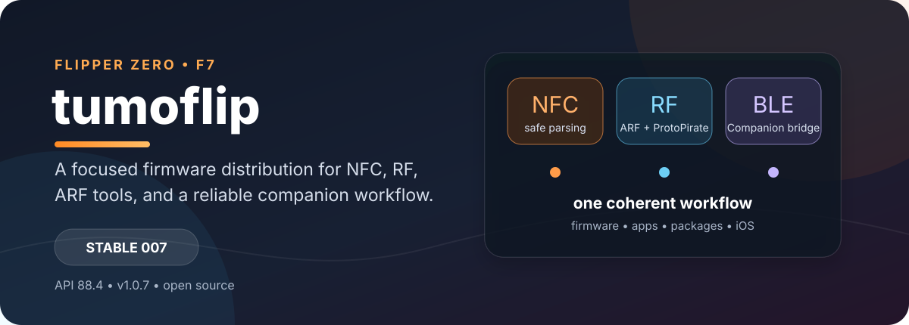
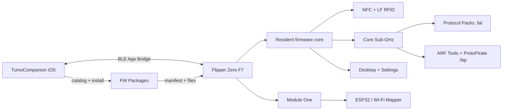

<div align="center">



# Tumoflip

**A focused, open-source firmware distribution for Flipper Zero.**

[](https://github.com/squazaryu/tumoflip/releases/latest)
[](https://github.com/squazaryu/tumoflip/actions/workflows/release.yml)


[](LICENSE)

[Install stable](https://github.com/squazaryu/tumoflip/releases/latest) ·
[Try dev builds](https://github.com/squazaryu/tumoflip/releases) ·
[TumoCompanion](https://github.com/squazaryu/TumoCompanion) ·
[FW Packages](https://github.com/squazaryu/tumoflip-fw-packages)

</div>

Tumoflip brings the firmware, apps, external radio tools, iOS companion, and
package delivery into one predictable workflow. It keeps the familiar Flipper
Zero experience, then adds the parts we use every day: safer NFC parsing,
ARF/ProtoPirate radio tools, protocol packs, BLE App Bridge, Module One
workflows, and reproducible package releases.

The project is independent. We selectively integrate upstream improvements and
keep Tumoflip-specific changes, release identities, and package contracts in
this repository.

> **Current stable:** `t-flppr-fw-007` (`v1.0.7`) · API `88.4` · Flipper Zero F7
>
> Dev builds are for testing. Stable releases are immutable and are promoted
> only after the agreed software checks and physical-device validation.

## Why Tumoflip?

| You want… | Tumoflip gives you… |
| --- | --- |
| A reliable everyday Flipper | A conservative core with focused memory, parser, and radio hardening. |
| More than the stock radio workflow | ARF tools, ProtoPirate, Protocol Packs, internal/external CC1101 routing, and a clear RAM boundary. |
| NFC that fails safely | MIFARE Classic parser protection, MF0AES authentication guards, FeliCa validation, and protected protocol plugins. |
| A useful phone workflow | TumoCompanion for firmware, packages, BLE App Bridge, RTC sync, transfer progress, and device verification. |
| Repeatable package updates | A separate FW Packages catalog with manifests, checksums, rollback-aware installation, and protected-app auditing. |

## How it compares

There is no single “best” Flipper firmware. Each project optimizes for a
different balance of upstream alignment, UI, bundled features, and release
control. This table is a practical orientation, not a benchmark.

| Project | Primary focus | Best fit when you want… | Tumoflip’s relationship |
| --- | --- | --- | --- |
| [Official Flipper Zero firmware](https://github.com/flipperdevices/flipperzero-firmware) | Upstream reference implementation | The closest path to the vendor firmware and its release cadence | Tumoflip follows the platform and selectively ports upstream fixes. |
| [Unleashed](https://github.com/DarkFlippers/unleashed-firmware) | Broad community feature and app ecosystem | A community-oriented distribution with a large set of ready-to-use additions | Tumoflip reviews selected Unleashed changes instead of mirroring the whole tree. |
| [Momentum](https://github.com/Next-Flip/Momentum-Firmware) | Feature-rich daily-driver experience and UI polish | A broad, opinionated firmware experience with extensive customization | Tumoflip borrows compatible ideas selectively and keeps its own architecture and package boundary. |
| **Tumoflip** | Integrated workflow and controlled distribution | NFC/RF work, ARF/ProtoPirate, iOS companion, and predictable FW Packages updates | Own firmware identity, release gates, manifests, and protected-app audit. |

## Feature map

| | Area | What is included |
|:--:| --- | --- |
| 🧿 | **NFC** | MIFARE Classic and Plus safety fixes, MF0AES support, ISO15693 improvements, transit-card parsers, Bambu Lab parser, and protected protocol FALs. |
| 📡 | **Radio** | Core Sub-GHz, ARF, ProtoPirate, adaptive hopping, Protocol Packs, Radio Broker, and internal/external CC1101 selection. |
| 🧭 | **Desktop** | Custom Wii, Wii Vertical, DSi, and Vertical layouts; Module One and ARF Tools folders; favorites for apps, scripts, and folders. |
| 📱 | **Companion** | BLE App Bridge, RTC sync, package and firmware transfer activity, device verification, and iOS-first workflows. |
| 🧩 | **Packages** | Separate Base, ARF, Module One, and Protocol Packs catalogs with content-addressed manifests and independent releases. |
| 🛠️ | **Developer** | API 88.4, JS Runner as an FAP, SDK archives, release validation, acceptance telemetry, and reproducible build metadata. |

## Architecture at a glance

Tumoflip keeps memory-heavy or optional functionality outside the resident core
whenever possible. The result is a smaller always-loaded surface and clear
failure boundaries when a package or external module is unavailable.



## The parts people usually install Tumoflip for

<details>
<summary><strong>NFC and card workflows</strong></summary>

- MIFARE Classic parser hardening for partial and legacy dumps.
- MIFARE Ultralight AES authentication, safe dictionary behavior, and explicit
  success/failure/skip reporting.
- MIFARE Plus SL3 support and the protocol-plugin split that keeps NFC RAM under
  control.
- FeliCa Lite block-count validation and EMV parser hardening.
- ISO15693 multi-block emulation with bounded parser writes.
- Bambu Lab filament-spool and Moscow social-card subscription parsers.
- Read-only, device-side verification of saved NFC, LF RFID, and iButton files
  through TumoTag Verify.

See the [hardware regression checklist](docs/hardware-regression-checklist.md)
for scenarios that require a physical card.

</details>

<details>
<summary><strong>ARF, ProtoPirate, and Sub-GHz</strong></summary>

- ProtoPirate v3.2 integrated into the Tumoflip ARF workflow.
- Separate ARF Tools FAPs so heavy utilities do not consume the core app heap.
- Protocol Packs loaded from SD and selected by group from the normal Sub-GHz
  receiver.
- Adaptive hopping, signal hold, receive-only preset scan, and a Radio Broker
  for exclusive internal/external CC1101 ownership.
- Shuka Auto decode-only packs and selected ARF automotive protocols.
- External CC1101 support, including the T-Embed C1101 Plus workflow where the
  connected module and app support it.

Read the [Sub-GHz architecture](docs/subghz-architecture.md),
[Protocol Packs guide](docs/subghz-protocol-packs.md), and
[ARF boundary](docs/arf-subghz-full.md) before building or adding a decoder.

</details>

<details>
<summary><strong>Desktop, Module One, and daily workflow</strong></summary>

- Custom Desktop layouts: Wii, Wii Vertical, DSi, and Vertical.
- `8/1` Module One and `ARF Tools` folders in the Desktop flow.
- Favorites can launch built-in apps, external `.fap` apps, `.js` scripts, and
  selected folders.
- Tumo XRemote profiles with validated IR/Sub-GHz sources, repair, import,
  export, and rollback-safe writes.
- WiFi Mapper for passive ESP32 scan logging, session storage, GeoJSON export,
  and optional phone-assisted location data.
- File Browser memory reductions for large directories.

</details>

<details>
<summary><strong>BLE App Bridge and TumoCompanion</strong></summary>

The [TumoCompanion](https://github.com/squazaryu/TumoCompanion) app is the
recommended iOS companion. It can:

- install stable and dev firmware;
- install and reconcile FW Packages;
- verify protected apps on the device;
- synchronize the Flipper RTC with the iPhone;
- show transfer progress for firmware, packages, plugins, and ESP32 files;
- exchange bounded app commands through the BLE App Bridge.

The bridge supports the backward-compatible `FAB1` protocol and the framed
`FAB2` protocol with request IDs, capability discovery, ordered chunks, and
explicit errors. See [App Bridge v2](docs/app-bridge-v2.md) and
[App Bridge v3](docs/app-bridge-v3.md).

</details>

## FW Packages are deliberately separate

Firmware and packages have different lifecycles, so they are not tied to one
firmware release number. A package remains installable as long as its manifest
declares compatibility with the device API and target; a new firmware build
does not make an unchanged package obsolete.

The separate [tumoflip-fw-packages](https://github.com/squazaryu/tumoflip-fw-packages)
repository owns package-only releases. The firmware release may contain a
manifest snapshot for the installer, but it does not silently replace the
catalog repository.

The catalog is split into four groups:

| Group | Typical contents |
| --- | --- |
| **Base** | Independent utility and tool FAPs. |
| **ARF** | Automotive radio tools and decoders. |
| **Module One** | ESP32, Wi-Fi Mapper, and hardware-module apps. |
| **Protocol Packs** | Optional `.fal` Sub-GHz decoder groups. |

See [Tumoflip Packages](docs/tumoflip-packages.md) for the manifest schema,
rollback rules, checksums, and catalog baseline policy.

## Stable and Dev channels

| Channel | Identity | Intended use | Where to get it |
| --- | --- | --- | --- |
| **Stable** | `t-flppr-fw-007` | Daily use and repeatable installations | [Latest release](https://github.com/squazaryu/tumoflip/releases/latest) |
| **Dev** | `t-dev-008-009` | Hardware checks and feature validation | [All releases](https://github.com/squazaryu/tumoflip/releases) |

Stable tags, firmware archives, manifests, and package-only releases are
immutable. A new package catalog does not overwrite a firmware release, and a
new firmware release does not rewrite an older package catalog.

## Install

### iOS — recommended

1. Install or update [TumoCompanion](https://github.com/squazaryu/TumoCompanion).
2. Connect the Flipper Zero over BLE.
3. Open **Updates → Firmware → Stable** and select `t-flppr-fw-007`.
4. Install FW Packages separately from **Updates → FW Packages** when needed.

Back up `/int` and important SD-card files before flashing. Custom apps,
settings, IR files, and Sub-GHz files should be copied somewhere safe.

### qFlipper or SD card

Download the update package from the
[GitHub release](https://github.com/squazaryu/tumoflip/releases/latest) and use
the normal qFlipper or Flipper SD-card update flow. The selected build artifact is:

```text
flipper-z-f7-update-t-dev-008-009.tgz
```

## Compatibility notes

- Target: Flipper Zero F7 (`target 7`).
- Firmware API: `88.4`.
- FAP/FAL files built for older or incompatible APIs may need to be replaced or
  rebuilt from the matching FW Packages catalog.
- The JS Runner is an application (`js_app.fap`); it is not required by the
  core firmware for ordinary Flipper operation.
- External ESP32 firmware is delivered through the package/app workflow and is
  not flashed automatically by the core firmware.

## Build and validate

Tumoflip uses the standard FBT toolchain plus release checks that cover the
updater layout, package manifest, API symbols, and checksums.

```sh
./fbt COMPACT=1 DEBUG=0 updater_package
python3 tools/tumoflip/validate_release.py --write-manifest
```

The release workflow additionally builds configured FAP/FAL targets, runs the
Tumoflip test suite, publishes the package manifest and ZIP, and records which
hardware checks still require a physical Flipper Zero.

## Documentation and contribution

- [Change log](CHANGELOG.md)
- [Hardware regression checklist](docs/hardware-regression-checklist.md)
- [Sub-GHz architecture](docs/subghz-architecture.md)
- [Sub-GHz Protocol Packs](docs/subghz-protocol-packs.md)
- [ARF Sub-GHz boundary](docs/arf-subghz-full.md)
- [BLE App Bridge](docs/app-bridge-v2.md)
- [Tumoflip asset packs](docs/tumoflip-asset-packs.md)
- [Firmware documentation](documentation/)

For a firmware bug, include the installed version, API, exact app or card,
reproduction steps, and whether the issue reproduces with only the stable
package catalog. Open an issue in this repository rather than the upstream
project when the behavior is Tumoflip-specific.

Tumoflip integrates selected work from the Flipper Zero ecosystem while keeping
copyright notices, licenses, and attribution intact. Relevant sources include
[Flipper-ARF](https://github.com/D4C1-Labs/Flipper-ARF),
[ARF-Shuka-Edition](https://github.com/shuka0158/ARF-Shuka-Edition), and the
upstream [Flipper Zero firmware](https://github.com/flipperdevices/flipperzero-firmware).

## Experimental features

TumoVM, TumoCard OS, NFC CCID Bridge, and some Module One runtime experiments
are intentionally separated from the stable support contract. They are useful
for development and prototyping, but they may change without the compatibility
guarantees of the stable core.

## License and responsible use

Tumoflip is released under [GPLv3](LICENSE). Use radio, NFC, BLE, and external
hardware features legally and responsibly. Keep backups before installing a
development build or testing a new package.
